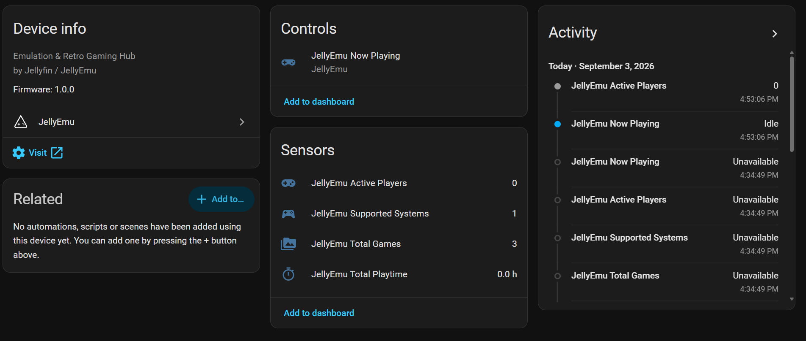
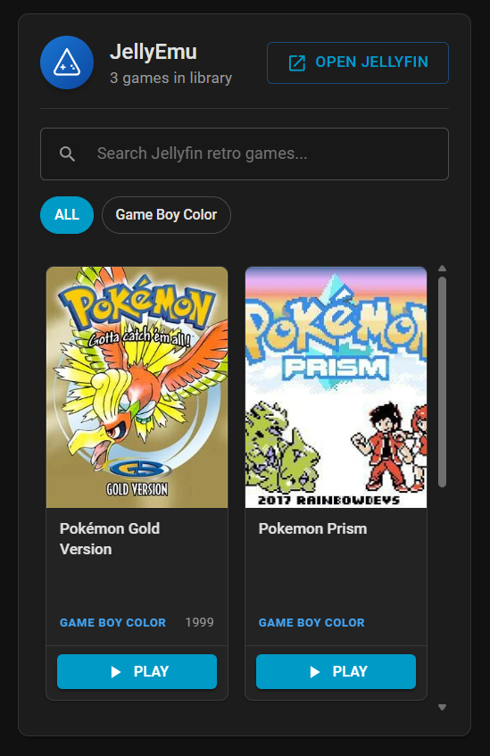

# JellyEmu for Home Assistant (HACS Integration & Dashboard Card)

<p align="center">
  <a href="https://github.com/Jellyfin-PG/JellyEmu-HomeAssistant-Plugin/actions">
    
  </a>

  <a href="https://github.com/Jellyfin-PG/JellyEmu-HomeAssistant-Plugin/releases">
    
  </a>

  <a href="https://hacs.xyz">
    
  </a>
  
  <a href="https://home-assistant.io">
    
  </a>
</p>

Monitor active retro gaming sessions in real-time, track household playtimes and leaderboards, trigger smart home lighting automations, and browse your retro game collection directly from Home Assistant.

---

## Screenshots

<p align="center">
  <a href="images/device-settings.png">
    
  </a>
   
  <a href="images/lovelace-card.png">
    
  </a>
</p>
<p align="center">
  <em>Click on an image to view it full size.</em>
</p>

---

## Features

- **Live Player Presence (`sensor.jellyemu_active_players`)**:
  - Live count of who is actively playing retro games right now.
  - State attributes include player name, game title, console/platform, device, and elapsed duration.
- **Media Player Entity (`media_player.jellyemu_now_playing`)**:
  - Automatically switches to `playing` when someone launches a retro game in Jellyfin.
  - Displays game title, platform, box art thumbnail, and elapsed game time.
  - Exposes `platform_theme_color` attribute (Nintendo Red, PlayStation Blue, Sega Cyan, etc.) for reactive RGB lighting automations.
- **Playtime Tracking (`sensor.jellyemu_total_playtime`)**:
  - Total household hours played pulling from JellyEmu's SQLite database.
- **Library Metrics (`sensor.jellyemu_total_games`, `sensor.jellyemu_systems`)**:
  - Tracks total ROMs indexed and supported retro console systems.
- **Custom Lovelace Card (`jellyemu-card.js`)**:
  - Material-UI (MUI) design system with game search, console category chips, configurable rows, visual settings editor, and one-click deep links to launch games in Jellyfin.

---

## Installation

### Method 1: HACS (Recommended)

1. Open **Home Assistant** $\rightarrow$ **HACS** $\rightarrow$ **Integrations**.
2. Click the three dots (top right) $\rightarrow$ **Custom repositories**.
3. Enter your JellyEmu repository URL:
   - **Repository**: `https://github.com/Jellyfin-PG/JellyEmu-HomeAssistant-Plugin`
   - **Category**: `Integration`
4. Click **Add** and install the integration.
5. Restart Home Assistant.

### Method 2: Manual Installation

1. Copy the `custom_components/jellyemu` directory to your Home Assistant config directory:
   ```text
   /config/custom_components/jellyemu/
   ```
2. Restart Home Assistant.

---

## Configuration

1. In Home Assistant, navigate to **Settings** $\rightarrow$ **Devices & Services** $\rightarrow$ **Add Integration**.
2. Search for **JellyEmu**.
3. Enter your connection details:
   - **Server URL**: Your Jellyfin server URL (e.g. `http://192.168.1.50:8096` or `https://jellyfin.yourdomain.com`).
   - **API Key**: An API key generated in your Jellyfin Dashboard (**Dashboard** $\rightarrow$ **Advanced** $\rightarrow$ **API Keys**).
4. Click **Submit**. All sensors and media players will be automatically discovered.

---

## Lovelace Card Installation (`jellyemu-card.js`)

1. Copy `cards/jellyemu-card.js` into your Home Assistant `/config/www/` folder:
   ```text
   /config/www/jellyemu-card.js
   ```
2. In Home Assistant, go to **Settings** $\rightarrow$ **Dashboards** $\rightarrow$ **Three Dots** $\rightarrow$ **Resources**.
3. Click **Add Resource**:
   - **URL**: `/local/jellyemu-card.js?v=1.0.0`
   - **Resource Type**: `JavaScript Module`
4. Add the card to any dashboard using YAML:
   ```yaml
   type: custom:jellyemu-card
   title: "JellyEmu Retro Gaming"
   ```

---

## Automation Examples

### 1. Game Mode Reactive RGB Lighting
Automatically match your gaming room LED strip or ambient backlights to the console of the game currently being played:

```yaml
alias: "JellyEmu: Console-Reactive Game Lighting"
trigger:
  - platform: state
    entity_id: media_player.jellyemu_now_playing
    to: "playing"
action:
  - service: light.turn_on
    target:
      entity_id: light.gaming_room_bias_light
    data:
      rgb_color: >
        
         [229, 37, 33]    {# NES / Nintendo Red #}
         [123, 82, 171]  {# SNES Purple #}
         [0, 158, 73]    {# N64 Green #}
         [139, 149, 109] {# Game Boy / Color Olive #}
         [46, 49, 146]   {# GBA Indigo #}
         [230, 0, 18]    {# Nintendo DS Red #}
         [0, 55, 145]    {# PlayStation Blue #}
         [0, 85, 165]    {# Sega Genesis Blue #}
         [255, 102, 0]   {# Sega Dreamcast Orange #}
         [255, 170, 0]   {# Arcade Amber #}
         [186, 12, 47]   {# Atari Crimson #}
         [0, 210, 255]                      {# Default Cyan #}
        
      brightness_pct: 80
```

### 2. Dim Room Lights when Game Starts
```yaml
alias: "JellyEmu: Dim Lights on Game Start"
trigger:
  - platform: numeric_state
    entity_id: sensor.jellyemu_active_players
    above: 0
action:
  - service: light.turn_on
    target:
      entity_id: light.living_room_ceiling
    data:
      brightness_pct: 20
```

### 3. Restore Normal Lighting when Games Stop
```yaml
alias: "JellyEmu: Restore Lights when Games Stop"
trigger:
  - platform: state
    entity_id: media_player.jellyemu_now_playing
    to: "idle"
action:
  - service: light.turn_on
    target:
      entity_id: light.living_room_ceiling
    data:
      brightness_pct: 85
```
